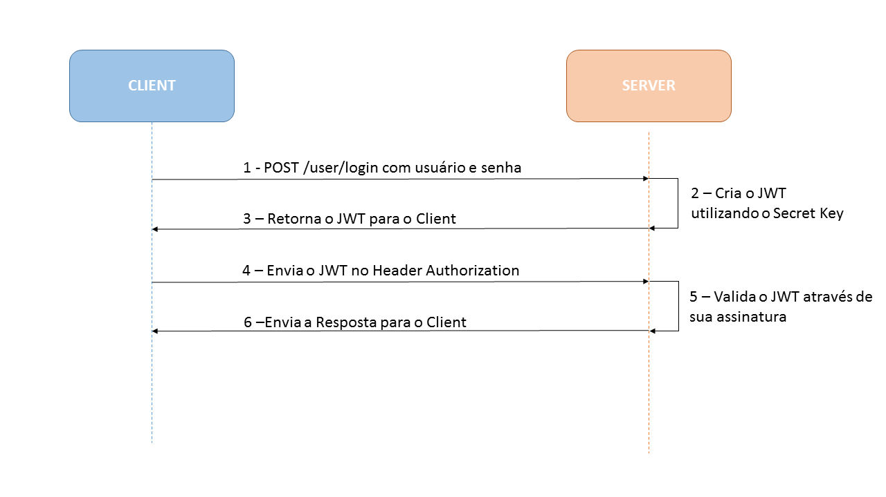

# <div align="center">JWT AUTHENTICATION AND AUTHORIZATION EXAMPLE</div>

<div>
    <p>
        JWT (Json Web Token) é um método usado pela indústria para realizar autenticação entre duas partes por meio de um token assinado 
        que autentica uma requisição web. <br>
        Comparado com a autenticação baseada em sessão onde é preciso armazenar a sessão no cookie, a vantagem da autenticação por JWT é que o token é armazenado no<br>
        client-side (Local Storage). <br>
        O intuito desse projeto é mostrar como é feito o fluxo de autenticação e autorização com JWT.   
    </p>
</div>

<div style="display: flex; justify-content: center; margin-top: 30px">
    
</div>

<div style="margin-top: 30px; margin-bottom: 20px">
    <p>
        De forma simplificada, a imagem acima mostra como é feito o fluxo de de autenticação via JWT.<br>
        1. É enviada uma requisição com usuário e senha, após a verificação do back-end, o token é retornado ao front-end e salvo no Local Storage.<br>
        2. Após o token ser salvo, deve ser colocado no header para as futuras requisições para autenticar o usuário. A partir dai em toda requisição
            é verificado o token, e se tudo estiver certo, os dados serão devolvidos ao front-end.
    </p>
</div>

## 📍 Rotas da API
<table style="width: 50%">
    <tr>
        <th>Endpoit</th>
        <th>Retorno</th>
    </tr>
    <tr>
        <td>/api/auth/signup</td>
        <td>Registro de usuário</td>
    </tr>
    <tr>
        <td>/api/auth/signin</td>
        <td>Login de usuário</td>
    </tr>
    <tr>
        <td>/api/test/user</td>
        <td>Mostra as informações do usuário</td>
    </tr>
    <tr>
        <td>/api/test/all</td>
        <td>Mostrar os conteúdos públicos</td>
    </tr>
    <tr>
        <td>/api/test/admin</td>
        <td>Mostrar o conteúdo dos admins</td>
    </tr>
    <tr>
        <td>/api/test/mod</td>
        <td>Mostrar o conteúdo dos moderadores</td>
    </tr>
</table>

## 🛠️ Tecnologias

<ul>
  <li><a href="https://reactjs.org/">React</a></li>
  <li><a href="https://nodejs.org/en/">Node</a></li>
  <li><a href="https://expressjs.com/pt-br/">Express</a></li>
  <li><a href="https://sequelize.org/">Sequelize</a></li>
  <li><a href="https://www.npmjs.com/package/jsonwebtoken">jsonwebtoken</a></li>
  <li><a href="https://getbootstrap.com/docs/4.6/getting-started/introduction/"/>Bootstrap</li>
  <li><a href="https://axios-http.com/ptbr/docs/intro" />Axios</li>
  <li><a href="https://www.docker.com/">Docker</a></li>
  <li><a href="https://www.postgresql.org/">Postgres</a></li>
</ul>

## ⚙️ Requisitos

<ul>
  <li><a href="https://git-scm.com/">Git</a></li>
  <li><a href="https://nodejs.org/en/">Node.js</a></li>
  <li><a href="https://www.docker.com/">Docker</a></li>
  <li><a href="https://www.npmjs.com/">NPM</a></li>
  <li><a href="https://yarnpkg.com/">Yarn</a></li>
</ul>

## 🚀 Instalação

```
$ git clone https://github.com/jeffersonximeness/jwt-authentication.git
$ cd jwt-authentication/

$ docker-compose up -d
```

## 💡 Sobre o projeto
<div style="margin-left: 30px">
    <p>
        O frontend do projeto foi construido com Typescript utilizando React com o framework Bootstrap para estilização, as requisições para a API foram feitas utilizando o Axios.<br>
        O backend/API foi construido com Node e o framework express. Para conexão com o banco de dados e consultas foi utilizado o ORM sequelize.
        Ao registrar um usuário, automaticamente é criado uma 'ROLE_USER' que é o tipo comum de usuário, além desse tipo tem: 'ROLE_MODERATOR' e 'ROLE_ADMIN'.<br>
        Cada tipo de usuário pode acessar conteúdos referentes a sua ROLE. A lógica de acesso aos conteúdos é feita pelo frontend.<br>
        A infraestrutura da aplicação é feita com Docker, são criados 3 conteiners, um para cada parte da aplicação (banco de dados, backend e frontend).
        Para orquestrar os conteiners foi utilizado Docker-compose.
    </p>
</div>
<br>
<p>A aplicação irá abrir localmente em <strong>http://localhost:8081</strong></p>